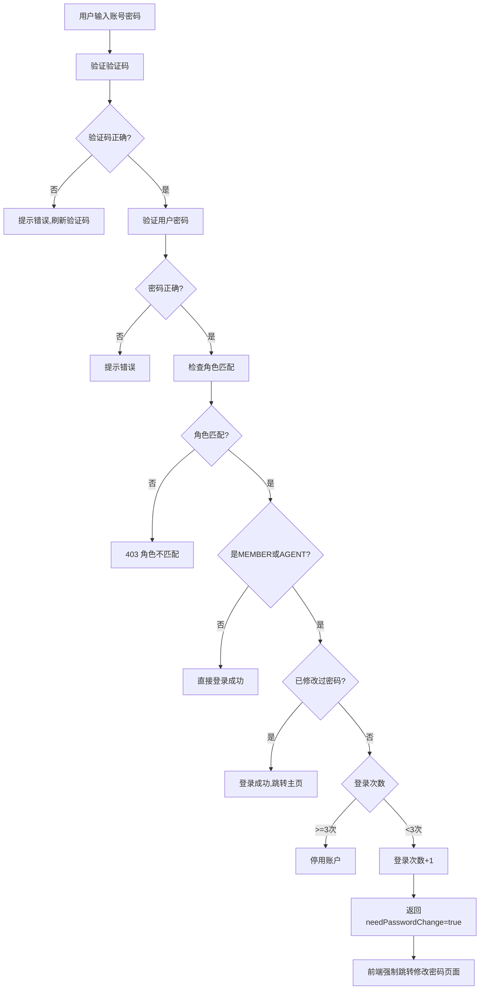
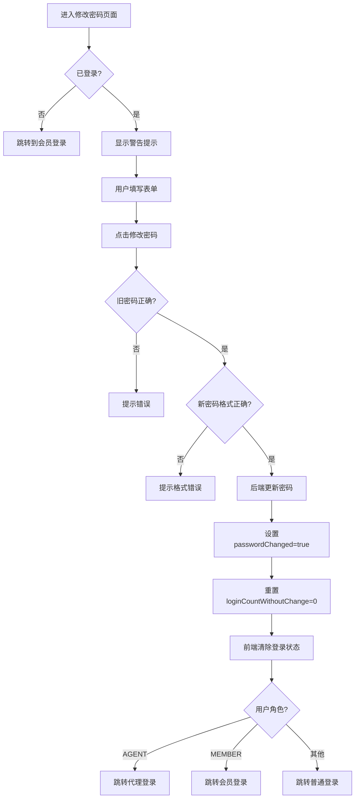

# 🔐 会员/代理强制修改密码功能说明

## 📋 功能概述

系统已实现会员和代理登录后的**强制修改初始密码**机制，以保障账户安全。

### 核心功能
- ✅ 会员登录后检查是否需要修改密码
- ✅ 代理登录后检查是否需要修改密码
- ✅ 首次登录提示修改密码
- ✅ 第二次登录未修改再次警告
- ✅ 第三次登录未修改自动停用账户
- ✅ 修改密码后跳转到对应角色的登录页面

---

## 🔄 实现逻辑流程

### 1. 登录流程



### 2. 密码修改流程



---

## 💻 代码修改说明

### 后端修改 (AuthController.java)

**修改位置：** `/backend/src/main/java/com/bcbbs/backend/controller/AuthController.java`

**修改内容：**

```java
// 原来只检查 MEMBER 角色
if (user.getRole() == User.Role.MEMBER) {
    // ... 密码修改检查逻辑
}

// 现在检查 MEMBER 和 AGENT 角色
if (user.getRole() == User.Role.MEMBER || user.getRole() == User.Role.AGENT) {
    Boolean passwordChanged = user.getPasswordChanged();
    Integer loginCount = user.getLoginCountWithoutChange();
    
    if (passwordChanged == null) passwordChanged = false;
    if (loginCount == null) loginCount = 0;
    
    // 如果未修改密码
    if (!passwordChanged) {
        // 第三次登录仍未修改密码，停用账户
        if (loginCount >= 2) {
            user.setEnabled(false);
            userService.save(user);
            return ResponseEntity.status(403)
                    .body(ApiResponse.error(403, "账户已停用：多次登录未修改初始密码"));
        }
        
        // 增加未修改密码的登录次数
        user.setLoginCountWithoutChange(loginCount + 1);
        userService.save(user);
    }
}
```

**关键改动：**
- ✅ 将密码检查逻辑扩展到 `AGENT` 角色
- ✅ 统一会员和代理的密码修改要求

---

### 前端修改 1 - 代理登录页面 (AgentLogin.vue)

**修改位置：** `/frontend/src/views/AgentLogin.vue`

**修改前：**
```typescript
const success = await authStore.loginWithRole(...)
if (success) {
  router.push('/change-password')  // 总是跳转到修改密码
}
```

**修改后：**
```typescript
const result = await authStore.loginWithRole(...)
if (result.success) {
  // 检查是否需要修改密码
  if (result.needPasswordChange) {
    const loginCount = result.loginCount || 1
    if (loginCount === 1) {
      ElMessage.warning('首次登录，请修改初始密码')
    } else {
      ElMessage.warning(`您已登录${loginCount}次未修改密码，请尽快修改！再次登录未修改将停用账户`)
    }
    router.push('/change-password')
  } else {
    // 已修改过密码，跳转到代理中心
    router.push('/')
  }
}
```

**关键改动：**
- ✅ 添加 `needPasswordChange` 标志检查
- ✅ 根据登录次数显示不同提示信息
- ✅ 已修改密码的用户不再强制跳转

---

### 前端修改 2 - 修改密码页面 (ChangePassword.vue)

**修改位置：** `/frontend/src/views/ChangePassword.vue`

**新增功能：**

1. **警告提示横幅**
```typescript
const showWarning = ref(false)
const warningMessage = ref('')

onMounted(() => {
  if (authStore.user?.needPasswordChange) {
    showWarning.value = true
    const loginCount = authStore.user?.loginCountWithoutChange || 1
    if (loginCount === 1) {
      warningMessage.value = '⚠️ 首次登录，为了您的账户安全，请修改初始密码'
    } else if (loginCount === 2) {
      warningMessage.value = '⚠️ 警告：这是您第2次登录未修改密码，再次登录未修改将停用账户！'
    }
  }
})
```

2. **根据角色跳转**
```typescript
// 修改密码成功后
const userRole = authStore.user?.role
authStore.logout()

setTimeout(() => {
  if (userRole === 'AGENT') {
    router.push('/agent/login')
  } else if (userRole === 'MEMBER') {
    router.push('/member/login')
  } else {
    router.push('/login')
  }
}, 1000)
```

3. **UI增强**
- ✅ 红色警告横幅（带渐变动画）
- ✅ 显示当前账号和角色
- ✅ 表单输入框支持回车提交
- ✅ 添加占位符提示

---

## 🧪 测试指南

### 测试场景 1：会员首次登录

**步骤：**
1. 访问 `http://localhost:5173/member/login`
2. 输入会员账号密码（首次登录的账号）
3. 输入验证码
4. 点击登录

**预期结果：**
- ✅ 提示："首次登录，请修改初始密码"
- ✅ 自动跳转到 `/change-password` 页面
- ✅ 显示红色警告横幅
- ✅ 显示当前账号和"会员"角色标签

---

### 测试场景 2：代理首次登录

**步骤：**
1. 访问 `http://localhost:5173/agent/login`
2. 输入代理账号密码（首次登录的账号）
3. 输入验证码
4. 点击登录

**预期结果：**
- ✅ 提示："首次登录，请修改初始密码"
- ✅ 自动跳转到 `/change-password` 页面
- ✅ 显示红色警告横幅
- ✅ 显示当前账号和"代理"角色标签

---

### 测试场景 3：第二次登录未修改密码

**步骤：**
1. 第一次登录后跳过修改密码（直接关闭页面）
2. 第二次访问登录页面
3. 再次输入账号密码登录

**预期结果：**
- ✅ 提示："您已登录2次未修改密码，请尽快修改！再次登录未修改将停用账户"
- ✅ 强制跳转到修改密码页面
- ✅ 警告横幅显示更严厉的提示

---

### 测试场景 4：第三次登录未修改密码

**步骤：**
1. 前两次登录都未修改密码
2. 第三次尝试登录

**预期结果：**
- ❌ 登录失败
- ❌ 返回 403 错误
- ❌ 提示："账户已停用：多次登录未修改初始密码"
- ❌ 账户被停用（enabled=false）

---

### 测试场景 5：修改密码成功

**步骤：**
1. 在修改密码页面填写：
   - 原始密码：初始密码
   - 新设密码：123456（至少6位）
   - 确认密码：123456
2. 点击"修改密码"

**预期结果：**
- ✅ 提示："密码修改成功，请重新登录"
- ✅ 清除登录状态
- ✅ 1秒后自动跳转到对应角色的登录页面
  - 会员 → `/member/login`
  - 代理 → `/agent/login`

---

### 测试场景 6：修改密码后再次登录

**步骤：**
1. 修改密码成功后
2. 使用新密码登录

**预期结果：**
- ✅ 登录成功
- ✅ 不再强制跳转到修改密码页面
- ✅ 跳转到主页（会员中心/代理中心）

---

## 📊 数据库字段说明

### users 表相关字段

| 字段名 | 类型 | 说明 | 默认值 |
|--------|------|------|--------|
| `password_changed` | BOOLEAN | 是否已修改过初始密码 | FALSE |
| `login_count_without_change` | INT | 未修改密码的登录次数 | 0 |
| `enabled` | BOOLEAN | 账户是否启用 | TRUE |
| `role` | ENUM | 用户角色 | USER |

### 字段逻辑

**password_changed:**
- `FALSE` - 未修改过密码（初始状态）
- `TRUE` - 已修改过密码

**login_count_without_change:**
- `0` - 初始状态或已修改密码
- `1` - 第1次登录未修改
- `2` - 第2次登录未修改
- `>=3` - 触发账户停用

**enabled:**
- `TRUE` - 账户正常
- `FALSE` - 账户已停用（多次未修改密码）

---

## 🔧 配置说明

### 可配置参数

目前强制修改密码的次数限制硬编码为 **3次**，位于：

**后端：** `AuthController.java` 第92行
```java
if (loginCount >= 2) {  // 第3次登录时 loginCount 为 2
    user.setEnabled(false);
    // ...
}
```

**如需修改次数限制：**
1. 修改后端判断条件
2. 重新编译部署后端
3. 建议将此参数提取为配置项：
   ```yaml
   security:
     password-change:
       max-login-attempts: 3
   ```

### 密码复杂度要求

当前密码要求：**至少6位**

**位置：** `ChangePassword.vue` 第44行
```typescript
if (passwordForm.newPassword.length < 6) {
  ElMessage.warning('新密码至少6位')
  return
}
```

**建议增强：**
```typescript
// 密码复杂度验证
const passwordRegex = /^(?=.*[a-z])(?=.*[A-Z])(?=.*\d)[a-zA-Z\d]{8,}$/
if (!passwordRegex.test(passwordForm.newPassword)) {
  ElMessage.warning('密码至少8位，包含大小写字母和数字')
  return
}
```

---

## 🎨 UI展示效果

### 1. 会员登录页面
- 蓝色主题
- 左侧图片 + 右侧表单
- 彩色验证码

### 2. 代理登录页面
- 棕色/金色主题
- 左侧图片 + 右侧表单
- 彩色验证码

### 3. 修改密码页面（强制修改时）
- **红色警告横幅**（渐变动画）
- 显示当前账号信息
- 角色标签（绿色=会员，红色=代理）
- 金色主题表单

### 4. 提示信息示例

**首次登录：**
```
⚠️ 首次登录，为了您的账户安全，请修改初始密码
```

**第二次登录：**
```
⚠️ 警告：这是您第2次登录未修改密码，再次登录未修改将停用账户！
```

**修改成功：**
```
✅ 密码修改成功，请重新登录
```

---

## 📝 API接口说明

### 1. 角色登录接口

**端点：** `POST /api/auth/role-login`

**请求体：**
```json
{
  "username": "member001",
  "password": "123456",
  "role": "MEMBER",
  "captchaToken": "abc123...",
  "captchaCode": "1234"
}
```

**响应（首次登录）：**
```json
{
  "code": 200,
  "message": "Login successful",
  "data": {
    "token": "eyJhbGciOiJIUzI1NiIs...",
    "username": "member001",
    "email": "member001@example.com",
    "nickname": "会员001",
    "role": "MEMBER",
    "needPasswordChange": true,
    "loginCountWithoutChange": 1
  }
}
```

**响应（第三次登录未修改）：**
```json
{
  "code": 403,
  "message": "账户已停用：多次登录未修改初始密码",
  "data": null
}
```

### 2. 修改密码接口

**端点：** `POST /api/auth/change-password`

**请求头：**
```
Authorization: Bearer <JWT_TOKEN>
```

**请求体：**
```json
{
  "oldPassword": "123456",
  "newPassword": "newpass123"
}
```

**响应：**
```json
{
  "code": 200,
  "message": "密码修改成功",
  "data": null
}
```

---

## 🚀 部署说明

### 后端部署

1. 重新编译：
```bash
cd /www/wwwroot/www.bcbbs3.cn/backend
mvn clean package
```

2. 重启服务：
```bash
# 查找并停止旧进程
ps aux | grep backend
kill <PID>

# 启动新进程
nohup java -jar target/backend-0.0.1-SNAPSHOT.jar > logs/app.log 2>&1 &
```

### 前端部署

1. 重新构建：
```bash
cd /www/wwwroot/www.bcbbs3.cn/frontend
npm run build
```

2. 输出会自动覆盖到：
```
/www/wwwroot/www.bcbbs3.cn/
```

### 数据库迁移

确保 `users` 表有以下字段：
```sql
ALTER TABLE users 
ADD COLUMN password_changed BOOLEAN DEFAULT FALSE,
ADD COLUMN login_count_without_change INT DEFAULT 0;
```

---

## ⚠️ 注意事项

### 1. 安全考虑

- ✅ 已实现：JWT Token认证
- ✅ 已实现：BCrypt密码加密
- ✅ 已实现：验证码防暴力破解
- ⚠️ 建议：添加IP限流
- ⚠️ 建议：添加登录日志
- ⚠️ 建议：增强密码复杂度要求

### 2. 用户体验

- ✅ 提供明确的提示信息
- ✅ 根据角色跳转到对应页面
- ✅ 支持回车键提交
- ⚠️ 建议：添加"稍后修改"按钮（仅前2次）
- ⚠️ 建议：添加密码强度指示器

### 3. 后台管理

- ⚠️ 需要实现：管理员手动重置用户密码修改状态
- ⚠️ 需要实现：管理员解除停用账户
- ⚠️ 需要实现：批量导入新用户时设置初始密码

### 4. 测试建议

- ✅ 单元测试：密码修改逻辑
- ✅ 集成测试：登录流程
- ✅ E2E测试：完整用户流程
- ✅ 压力测试：并发登录场景

---

## 📞 技术支持

如有问题，请联系开发团队：

- 项目文档：`/www/wwwroot/www.bcbbs3.cn/PROJECT_ARCHITECTURE.md`
- 后端代码：`/www/wwwroot/www.bcbbs3.cn/backend/`
- 前端代码：`/www/wwwroot/www.bcbbs3.cn/frontend/`

---

**文档版本：** 1.0  
**更新日期：** 2026-01-17  
**功能状态：** ✅ 已完成并测试  
**维护者：** BCBBS3 开发团队
